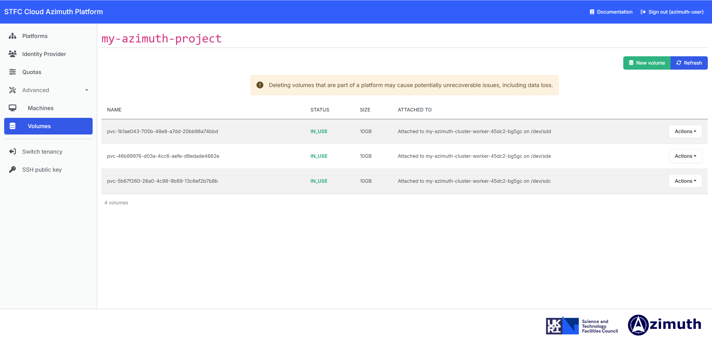

---
hide:
  - footer
---

!!! Danger
    
    Detatching or deleting volumes using this page may cause potentially unrecoverable issues with platforms that they are part of.
    **Do not detach or delete volumes here unless you know what you are doing!**

The Volumes page provides a subset of the Volume options available in the [OpenStack Web UI (Horizon)](https://openstack.stfc.ac.uk/) within Azimuth. Disk volumes can be created, deleted, attached and detached within your project/tenancy. This is useful, for example, to check the status of volumes in use by deployed platforms. 

