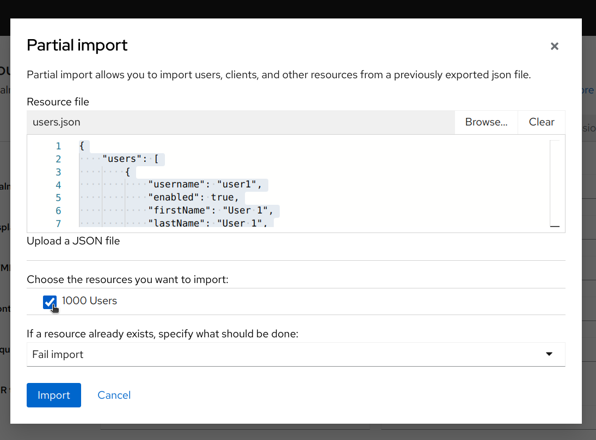

---
hide:
  - footer
---

### Introduction to Identity Management

Azimuth has two kinds of users: "Platform Admins" who are able to sign into Azimuth, manage deployed platforms in a tenancy, and administer access to those platforms; and "Platform Users", who can access one or more platforms deployed onto Azimuth.

Only Platform Admins require an OpenStack account. This is because each azimuth tenancy (i.e. OpenStack Project) has an associated ["realm"](https://www.keycloak.org/docs/latest/server_admin/#configuring-realms) in Keycloak. Keycloak is an Identity Management Platform, which allows platform access to be granted granularly per user.

For example, say you are running a workshop on JupyterHub. Using Keycloak, a project admin can create users in the associated realm for each workshop attendee. These attendees can then only be granted access to one specific JupyterHub deployment for the workshop, after which their access can be revoked.

Important concepts in Keycloak are Users, Clients, Realm Roles and Groups

|Concept|Definition|
|-------|----------|
|Users|	Individuals who can authenticate into the platform. In Keycloak, users can be created per realm, allowing fine-grained access control specific to each Azimuth tenancy.|
|Clients|Applications or services (e.g. JupyterHub) that users can access through Keycloak. Clients are configured within a realm and represent the endpoints that Keycloak secures.|
|Realm Roles|Permissions that can be assigned to users within a realm. These define what actions a user can perform and are often tied to specific clients or administrative functions.|
|Groups|	Collections of users within a realm that allow for bulk assignment of roles and permissions.</br>Each realm typically includes at least two groups: `admins` and `platform-users`, along with unique roles for each deployment.</br></br>`admins` have admin status for a realm, allowing them to perform actions on the Keycloak admin console.</br></br>`platform-users` are granted access to _every_ deployment in the realm.</br></br> Alternatively, the unique groups for each deployment can be used to grant access to a single deployment. Additionally, subgroups are created which can grant access to a single service under that deployment.|

#### Groups Example
Consider a Kubernetes cluster platform deployed under azimuth, `my-binderhub`. Two services are exposed under it if enabled, BinderHub and JupyterHub.

- `platform-users` have access to both services, and every other deployment in the tenancy.
- Users in the `kubeapp-my-binderhub` have access to both services, BinderHub and JupyterHub, but no other deployments.
- Users in the `kubeapp-my-binderhub/my-binderhub-binderhub-azimuth-jupyterhub` group have access to the JupyterHub, but not BinderHub.

**Admins can add users to these individual groups through the Keycloak dashboard, hence granting them access to individual services.**

### Bulk Importing Users
Bulk Importing/Generating a set of users can be achieved via a partial import to your Keycloak realm.

Here is a simple process to do so:

1. Download this helper script [csvToJsonConverterScript.sh](../assets/static/csvToJsonConverterScript.sh){:download="csvToJsonConverterScript"}
2. Set the script as executable with `chmod +x csvToJsonConverterScript.sh`
3. Create a CSV file (in a spreadsheet editor, or a text editor), with the following format, i.e.:

  ``` js
  username/*(1)!*/,firstName/*(2)!*/,lastName/*(3)!*/,email/*(4)!*/,password/*(5)!*/,temporary/*(6)!*/,require_idp_link/*(7)!*/,realmRoles/*(8)!*/,groups/*(9)!*/
  mpython,Monty,Python,mpython@example.com,Password123,false,false,some_role,some_group
  gzilla,God,Zilla,gzilla@example.com,Password456,true,true,some_role;some_second_role,some_group;some_second_group
  ```

   1. Username. If using IAM authentication, this should be FedID.
   2. First Name
   3. Last Name
   4. Email Address
   5. Initial Password
   6. One of `true` or `false`. If `true`, the user will be prompted to change their password.
   7. One of `true` or `false`. If `true`, the user will be prompted to connect their account to an identity provider, i.e. Azimuth's Keystone-based default provider, or a custom provider you have set up i.e. IAM.
   8. A semicolon separated list of realm roles to assign to the user
   9. A semicolon separated list of groups to assign to the user

</nbsp>

3. Run the script to generate an equivalent JSON file with `./csvToJsonConverterScript.sh <input_file> <output_file>`
    1. I.e. `./csvToJsonConverterScript.sh myCreatedUserCSV.csv someOutputJsonFile.json`
4. On Keycloak, go to _Realm Settings_</br>
{ loading=lazy }
5. Click _Actions_, then _Partial Import_ in the top left</br>
{ loading=lazy }
6. Browse for and upload the JSON output, and check it for sanity, i.e. check the number of users, and the properties of the json
{ loading=lazy }
7. Click import, and wait for it to complete
8. Check the Users tab for the created users

### Adding an IAM-Based Identity Provider
!!! warning
    This process hasn't yet been fully tested and explored against user use cases. Please reach out with comments, improvements or issues; and carefully consider each step

In addition to allowing login via the same account interface as OpenStack (via Keystone, through the Azimuth identity provider), an additional custom identity provider can be setup.

This can, for example, use IRIS-IAM/SKA-IAM.
Users can then link their accounts to allow logging in through IAM; or groups can be assigned based on IAM groups (for example, to allow access to JupyterHub for all users in a research group)

To set this up:

1. On Keycloak, open Identity Providers from the sidebar
2. Press Add Provider → OpenID Connect v1.0
3. Set the Alias to something identifiable, i.e. "iris-iam"
4. Set the Display Name to be a human-readable equivalent, i.e. "IRIS-IAM" 
5. Copy the Redirect URI
6. Visit your IAM interface, for example https://iris-iam.stfc.ac.uk/ or https://ska-iam.stfc.ac.uk/, and login
7. Visit "My Clients" in the top left, and press New Client
8. Add a Redirect URI from the URI you copied from Keycloak
9. Set the client name, description, and contact email
10. In the Scopes tab, ensure `openid`, `profile`, `email`, and `preferred_username` are checked
11. In the Credentials tab, set `Token endpoint authentication method` to `Client secret over HTTP POST authentication`
12. Save the client
13. In the Main tab, copy the Client ID
14. Back in Keycloak, paste the Client ID
14. In IAM, in the credentials tab, copy the Client Secret
15. In Keycloak, paste the Client Secret
16. Use Discovery Endpoint is checked, then use one of:</br>
`https://iris-iam.stfc.ac.uk/.well-known/openid-configuration`</br>
`https://ska-iam.stfc.ac.uk/.well-known/openid-configuration`
17. Ensure Client Authentication is set to "Client secret sent as post"
18. Press Add
19. Open the newly added provider
20. Under OpenID Connect settings → Advanced, set "Scopes" to `openid profile email preferred_username`
21. Press Save

You now have a minimally functional login provider, allowing user accounts to be linked to IAM.

Existing users from the Azimuth provider (i.e. yourself) should be prompted to link their account to IAM when they log in.

#### Restrict access to a certain IAM group, and assign a Keycloak group
As an overview of restricting access by `claim`, and Mappers, these steps will allow you to restrict login access to a specific IAM group then give successful users a Keystone group to, for example, access JupyterHub

1. Under Keycloak → Identity Providers, open your custom OpenID identity provider for IAM
2. Under Advanced Settings, enable "Verify essential Claim"
3. For Essential claim, enter `groups`
   1. For other use cases, this can be any claim allowed by your set of OpenID scopes. See the INDIGO IAM documentation.
4. Essential claim value can take a RegEx string. For example, `.*stfc-cloud.*` to require all users be in the `stfc-cloud` IAM group. Remember to properly escape RegEx characters
{ loading=lazy }
5. At the top, visit the Mappers tab and press Add Mapper
6. Since we have already verified they are in our allowed IAM group, you can select Hardcoded Group → Select your JupyterHub access group
   1. Alternately, there are more advanced mapper types, some of which themselves support RegEx requirements
   2. For example, to allow all users to login but only allow a certain IAM group to access JupyterHub:
      1. Mapper type: Advanced Claim to Group
      2. "Add Claims" → Key `groups`, value `.*stfc-cloud.*`
      3. Enable "RegEx claim values"
      4. Set the group to grant
7. Press Save, after naming it