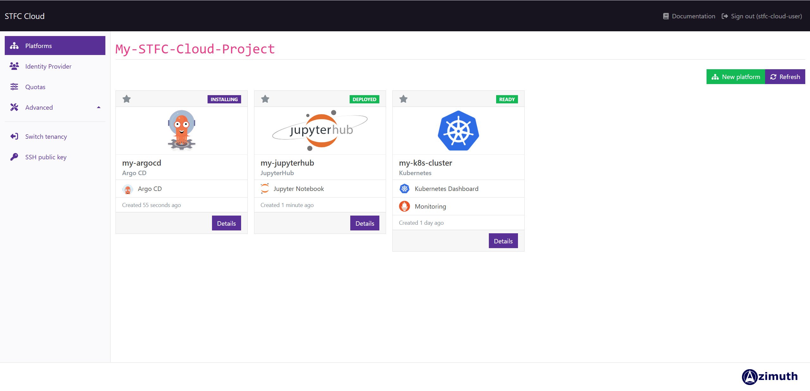
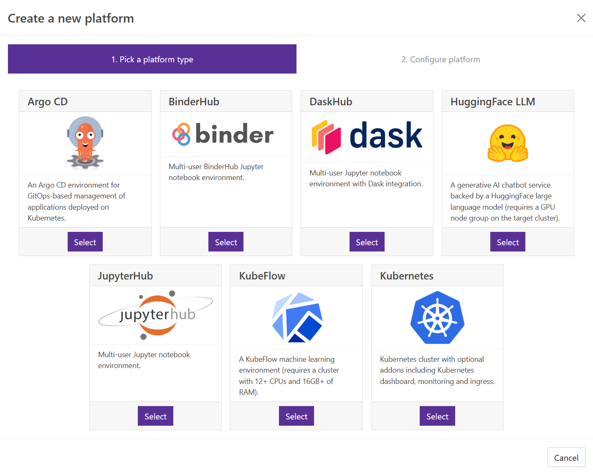

---
hide:
  - footer
---

STFC's Azimuth platform is powered by [Azimuth](https://github.com/azimuth-cloud/azimuth/), a self-service portal for managing cloud resources with a particular focus on simplifying the use of cloud for scientific computing, high-performance computing (HPC) and artificial intelligence (AI).

{ loading=lazy }

If this is your first visit to the Azimuth portal, or you would just like to know more about how to get access to a cloud project - [get started](#getting-started) with Azimuth science platforms.

## Disclaimer
- The STFC Cloud Azimuth platform is still in development, therefore data loss could occur, and it is recommended that no data be stored on there that you do not wish to lose.
- Updates/patches of the platform may come at short notice, but we endeavour to inform users one week in advance whenever possible.
- Support for Azimuth-related issues is only offered during regular working hours, out-of-hours support is not currently being provided.
- For any issues or for feedback please contact us via STFC Cloud Support: [cloud-support@stfc.ac.uk](mailto:cloud-support@stfc.ac.uk)
- Please read the STFC Cloud Azimuth Platform SLA before use: [Link]

## Getting Started
### Accessing Azimuth
Azimuth can be accessed here:

[https://portal.apps.cape.stfc.ac.uk](https://portal.apps.cape.stfc.ac.uk){ .md-button }

Access to an STFC Cloud OpenStack project is required to use Azimuth.

You log in as you would normally to the STFC Cloud OpenStack interface, either using FedID or IAM authentication (IRIS-IAM or SKA-IAM). This will then take you to a screen where you select which of your projects you want to work in.

A cloud project (or cloud tenancy) is an organizational unit in the cloud to which users are assigned. Users can be members of one or more projects. 

Cloud resources belong to a *project* and not a *user*. This means that all resources within a project are visible and editable by all members of the project.

To be allocated a cloud project, or if you are unable to access an existing project when logging in with FedID or IAM as you usually would for OpenStack, please contact [cloud support](mailto:cloud-support@stfc.ac.uk) or your project coordinator.

Other users can be granted access to all or specific platforms deployed on Azimuth, without having access to the Azimuth management dashboard itself, through the [Identity Provider](./identity_provider/identity_provider.md).

## Platforms
Platforms can be deployed directly from the Azimuth Platforms interface:

{ loading=lazy }

### [:simple-kubernetes: Kubernetes](platforms/kubernetes.md)
A fully-featured [Kubernetes](https://kubernetes.io/) container orchestration cluster.

## Kubernetes Applications
Kubernetes Applications require an existing [Kubernetes cluster](platforms/kubernetes.md) before they can be deployed.
### [:simple-jupyter: JupyterHub](platforms/kubernetes-applications/jupyterhub.md)
A multi-user JupyterHub on Kubernetes, powered by [zero-to-jupyterhub](https://zero-to-jupyterhub.readthedocs.io/en/latest/).

### [:simple-dask: DaskHub](platforms/kubernetes-applications/daskhub.md)
A multi-user DaskHub on Kubernetes. [Dask](https://docs.dask.org/en/stable/) is a flexible library for parallel computing in Python.

### [:simple-argo: ArgoCD](platforms/kubernetes-applications/argocd.md)
[ArgoCD](https://argo-cd.readthedocs.io/en/stable/) provides a declarative GitOps Continuous Delivery (CD) platform for Kubernetes clusters.

### [:logos-binderhub: BinderHub](platforms/kubernetes-applications/binderhub.md)
[BinderHub](https://binderhub.readthedocs.io/en/latest/) allows a reproducible set of Jupyter notebooks to be deployed onto a JupyterHub instance.

### [:simple-huggingface: HuggingFace-LLM](platforms/kubernetes-applications/huggingface-llm.md)
A generative AI chatbot service backed by a [HuggingFace](https://huggingface.co/) model, exposed via a convenient web interface.

### [:logos-kubeflow: KubeFlow](platforms/kubernetes-applications/kubeflow.md)
[KubeFlow](https://www.kubeflow.org/) is a machine learning toolkit for Kubernetes clusters, using Jupyter Notebooks and [TensorFlow](https://www.tensorflow.org/).
