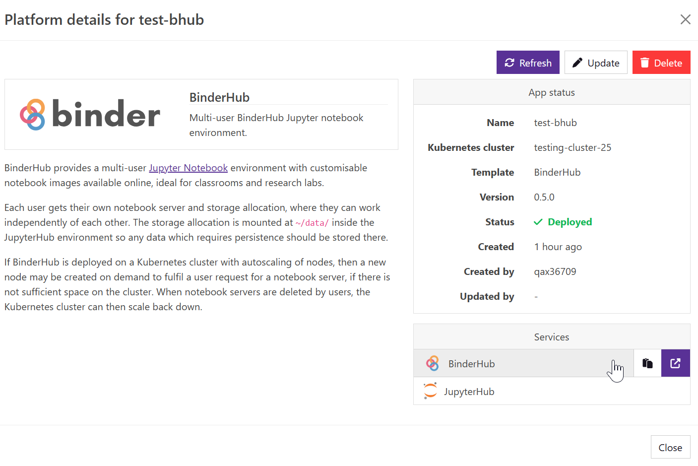

---
hide:
  - footer
---
!!! Warning

    Deploying BinderHub requires an existing [Kubernetes cluster](../kubernetes.md).

### Introduction
[BinderHub](https://binderhub.readthedocs.io/en/latest/) allows a set of Jupyter notebooks to be deployed onto a JupyterHub instance from a Git repository, under a reproducible environment. When a user accesses a BinderHub instance, a Docker image is built from the Git repository's environment configuration (e.g. `requirements.txt`, `envionment.yaml`) and a temporary Jupyter notebook server is launched. This is useful for educators and researchers looking to make their code and corresponding data available to users through their web browser; to launch, edit and run without having to install anything locally. A public example can be found at https://mybinder.org/.

{ loading=lazy }

The BinderHub Kubernetes application is installed using the Platforms dashboard of Azimuth, onto an existing Kubernetes Cluster deployment. It is automatically exposed by Zenith, and access can be granted via the [Keycloak identity provider](../../identity_provider/identity_provider.md).

### Launch configuration

To get started, in the Platforms tab, press the  New Platform button, and select BinderHub.

You will then be presented with launch configuration options to fill in:

|**Option**                                | **Explanation**|
|------------------------------------------|---------------------------|
|Platform name|A name to identify the BinderHub platform|
|Kubernetes cluster|The Kubernetes platform on which to deploy BinderHub. If one hasn't already been created, check out the [Kubernetes Overview](../kubernetes.md).|
|App version|The version of the BinderHub Azimuth Application to use.|
|Servers per user|The maximum number of JupyterHub servers each user can run simultaneously. Set to 0 for unlimited.|
|Notebook CPUs|The number of CPUs to allocate to each user notebook.|
|Notebook RAM|The amount of RAM to allocate to each user notebook.|
|Notebook storage|The amount of disk storage to allocate to each user notebook.|
|Container registry storage|The storage allocated to BinderHub's docker image registry.|

### Using BinderHub
#### Accessing BinderHub
After creating the BinderHub platform, BinderHub and its corresponding JupyterHub will automatically be exposed by Azimuth's Zenith proxy.

They can be accessed via the link under Services.
{ loading=lazy }

### Managing Users
User management can be performed via the [Identity Provider, Keycloak](../../identity_provider/identity_provider.md).

Access to BinderHub and its JupyterHub can be granted by the platform or service specific Keycloak groups.