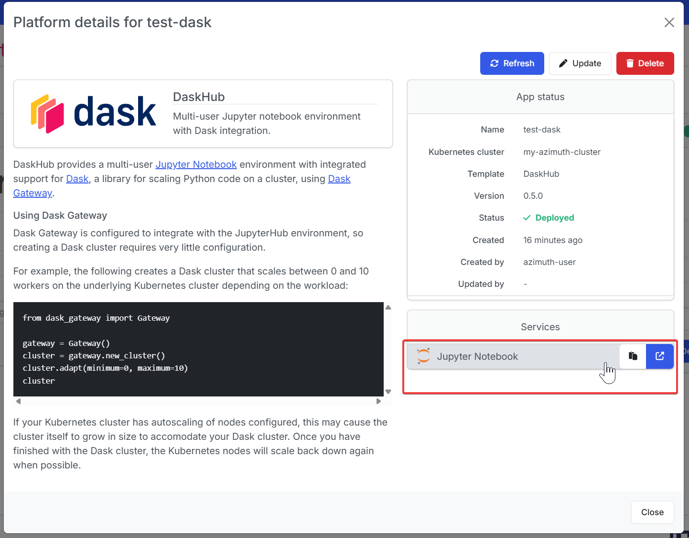

---
hide:
  - footer
---
!!! Warning

    Deploying DaskHub requires an existing [Kubernetes cluster](../kubernetes.md).

### Introduction
[DaskHub](https://github.com/dask/helm-chart/tree/main/daskhub) provides a multi-user, Dask-Gateway enabled JupyterHub. [Dask](https://www.dask.org/) is a library for scaling Python code across a cluster.

### Launch configuration

To get started, in the Platforms tab, press the  New Platform button, and select DaskHub.

You will then be presented with launch configuration options to fill in:

|**Option**                                | **Explanation**|
|------------------------------------------|---------------------------|
|Platform name|A name to identify the DaskHub platform|
|Kubernetes cluster|The Kubernetes platform on which to deploy DaskHub. If one hasn't already been created, check out the [Kubernetes Overview](../kubernetes.md).|
|App version|The version of the DaskHub Azimuth Application to use.|
|Notebook CPUs|The number of CPUs to allocate to each user notebook.|
|Notebook RAM|The amount of RAM to allocate to each user notebook.|
|Notebook storage|The amount of disk storage to allocate to each user notebook.|

### Using DaskHub
#### Accessing DaskHub
After creating the DaskHub platform, DaskHub's corresponding JupyterHub will automatically be exposed by Azimuth's Zenith proxy.

It can be accessed via the link under Services.
{ loading=lazy }

#### Using Dask Gateway

Dask Gateway is configured to integrate with the JupyterHub environment, so creating
a Dask cluster requires very little configuration.

For example, the following creates a Dask cluster that scales between 0 and 10 workers
on the underlying Kubernetes cluster depending on the workload:

```py
from dask_gateway import Gateway

gateway = Gateway()
cluster = gateway.new_cluster()
cluster.adapt(minimum=0, maximum=10)
cluster
```

If your Kubernetes cluster has autoscaling of nodes configured, this may cause the
cluster itself to grow in size to accomodate your Dask cluster. Once you have finished with the Dask cluster, the Kubernetes nodes will scale back down again when possible.