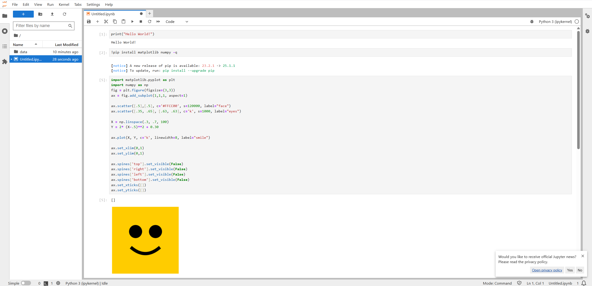
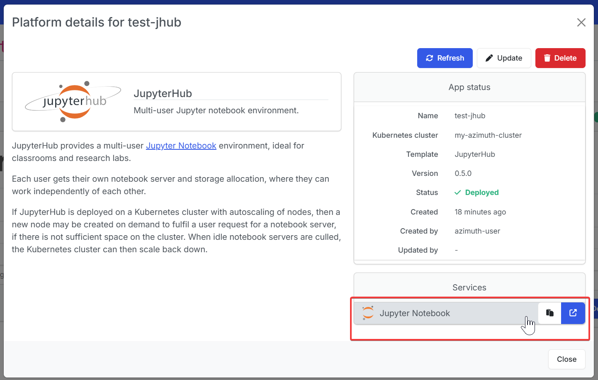

---
hide:
  - footer
---
!!! Warning

    Deploying JupyterHub requires an existing [Kubernetes cluster](../kubernetes.md).

### Introduction
[JupyterHub](https://zero-to-jupyterhub.readthedocs.io/en/latest/) allows users to interact with a computing environment through a webpage. As most devices have access to a web browser, JupyterHub makes it is easy to provide and standardize the computing environment for a group of people (e.g., for a class of students or an analytics team). JupyterHub is a web-interface through which many "singleuser" Jupyter notebooks (one per user) may be launched.

Upon accessing JupyterHub users are presented with a number of "Profiles": pre-installed Python, Julia and R environments aimed towards different use cases.

{ loading=lazy }

The JupyterHub Kubernetes application is installed using the Platforms dashboard of Azimuth, onto an existing Kubernetes Cluster deployment.

### Launch configuration

To get started, in the Platforms tab, press the  New Platform button, and select JupyterHub.

You will then be presented with launch configuration options to fill in:

|**Option**                                | **Explanation**|
|------------------------------------------|---------------------------|
|Platform name|A name to identify the JupyterHub platform|
|Kubernetes cluster|The Kubernetes platform on which to deploy JupyterHub. If one hasn't already been created, check out the [Kubernetes Overview](../kubernetes.md).|
|App version|The version of the JupyterHub Azimuth application to use.|
|Notebook CPUs|The number of CPUs to allocate to each user notebook.|
|Notebook RAM|The amount of RAM to allocate to each user notebook.|
|Notebook storage|The amount of disk storage to allocate to each user notebook.|

### Using JupyterHub
#### Accessing JupyterHub
After creating the JupyterHub platform, it will automatically be exposed by Azimuth's Zenith proxy.

JupyterHub can be accessed via the link under Services.
{ loading=lazy }

Users should be prompted to start a server, and be given three default options. 

!!! note
    Further development will allow for a custom image and/or a whole custom repo-to-docker codebase to be used

#### Profiles
{ loading=lazy }

|**Profile**                                | **Description**|
|------------------------------------------|---------------------------|
|[Python environment (minimal)](https://jupyter-docker-stacks.readthedocs.io/en/latest/using/selecting.html#jupyter-minimal-notebook)|A minimally functional Jupyter server; with basic commandline tools, a TeX environment and Python (along with the Conda and Mamba package managers).|
|[Data Science Notebook](https://jupyter-docker-stacks.readthedocs.io/en/latest/using/selecting.html#jupyter-datascience-notebook)|Contains [popular scientific Python packages](https://jupyter-docker-stacks.readthedocs.io/en/latest/using/selecting.html#jupyter-scipy-notebook), [the R interpreter and a basic set of data science packages](https://jupyter-docker-stacks.readthedocs.io/en/latest/using/selecting.html#jupyter-r-notebook), [rpy2](https://rpy2.github.io/doc/latest/html/index.html), and the [Julia compiler along with notebook support and HDF5](https://jupyter-docker-stacks.readthedocs.io/en/latest/using/selecting.html#jupyter-julia-notebook).|
|[GPU-enabled Machine Learning environment](https://github.com/iot-salzburg/gpu-jupyter)|Contains GPU support and drivers; along with TensorFlow, Keras, PyTorch, and everything in the above Data Science Notebook.|

!!! Warning
    The `GPU-enabled Machine Learning environment` profile will only launch on clusters with a node group that has machines with a GPU-enabled flavour. It may take 10-15 minutes to launch this profile for the first time on a newly deployed GPU node. This is because Nvidia CUDA drivers are installed first automatically in the background, then the large ~8GB profile docker image needs to be downloaded and loaded. While waiting, you may see a message saying "No Capacity" or "No Nodes match the affinity/selector". This is okay, so long as there is a GPU node group available.

#### Server Hub
To switch profile or restart the code server from JupyterLab, head to File → Hub Control Panel.

From there, the server may be stopped and relaunched.

### Managing Users
User management can be performed via the [Identity Provider, Keycloak](../../identity_provider/identity_provider.md).

Access to JupyterHub can be granted by the platform or service specific Keycloak groups.