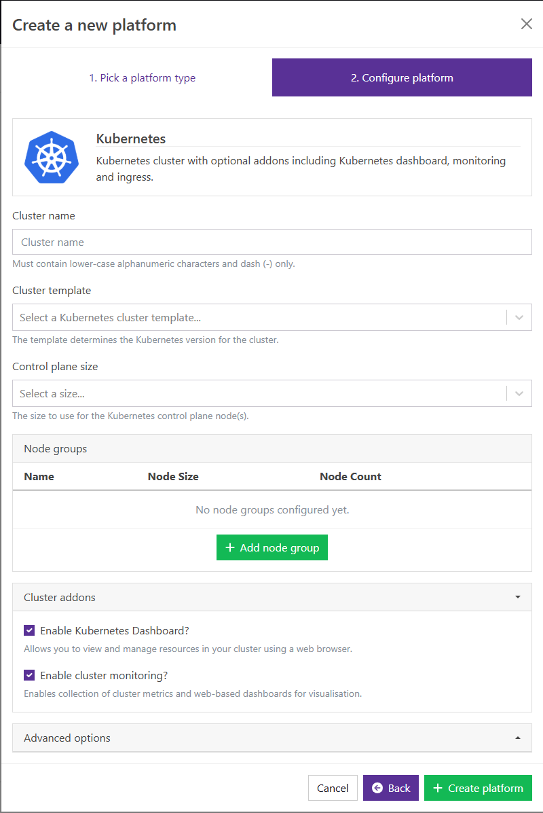

---
hide:
  - footer
---

### Introduction
The Kubernetes platform provides a fully-featured Kubernetes container orchestration cluster, with included monitoring, ingress and application dashboards. It can be used for running [Kubernetes applications](../index.md#kubernetes-applications) within Azimuth, or custom installations using either [Helm Charts](https://helm.sh/) or [Kustomize](https://kustomize.io/) to manage Kubernetes manifests.

A [kubeconfig](https://kubernetes.io/docs/concepts/configuration/organize-cluster-access-kubeconfig/) file for use with `helm` or `kubectl` is provided in platform **Details** after the platform has been launched.

### Launch configuration
!!! Warning

    Platforms and their names are visible to all members of the cloud project!

!!! Bug
    Azimuth currently incorrectly calculates quota predictions for new clusters. If a cluster doesn't fit within your quota, nodes may fail to create and become stuck in "Provisioning" or "Pending" without warning messages. **Please manually ensure you have enough OpenStack quota for any created clusters**, especially Disk Volume and Network Security Groups quota, until this issue is resolved. As an additional issue, Azimuth's Quota tab doesn't include every quota limit. For the time being, check using [OpenStack's Web UI (Horizon)](https://openstack.stfc.ac.uk/project/).

To get started, in the Platforms tab, press the  New Platform button, and select Kubernetes.

Or, when prompted to select a Kubernetes cluster when deploying any other platform, one can be quickly made using the green plus button:

{ loading=lazy }

You will then be presented with launch configuration options to fill in:

|**Option**                                | **Explanation**|
|------------------------------------------|---------------------------|
|**Cluster name**                         | A name to identify the Kubernetes cluster platform.|
|**Cluster template**                      | The cluster template defines the deployed Kubernetes [version](https://kubernetes.io/releases/). We aim to keep the most recent minor versions. When older ones are removed, the cluster version will be marked Deprecated and can be [Upgraded](#patching-deployments).|
|**Control plane size**                      | The size of the cloud instances to run the [Kubernetes control plane](https://kubernetes.io/docs/concepts/overview/components/#control-plane-components). The options in this menu are your available flavours in OpenStack, and the number of CPUs and quantity of RAM are displayed for each size.|

#### Node groups
!!! Warning
    
    All Kubernetes clusters must contain a least one node group of [Kubernetes worker nodes](https://kubernetes.io/docs/concepts/architecture/nodes/). 
    More worker nodes may be needed to deploy more apps, or for some apps to operate especially when they reserve resources. For example, JupyterHub will try to reserve a CPU core for each Jupyter server, hence servers may fail to deploy without enough worker nodes. 
    To mitigate issues with having too few worker nodes, Autoscaling can be used as described below. If the maximum worker count is reached, this indicates you may need to increase this maximum limit to match load requirements. 

!!! Info
    
    If you are creating a Kubernetes cluster to use with applications which require GPU, like HuggingFace LLM, be sure to select a Node Size that contains GPUs.

|**Option**                                | **Explanation**|
|------------------------------------------|---------------------------|
|**Name**                         | A name to identify the node group. Names are available inside the Kubernetes cluster as [node labels](https://kubernetes.io/docs/concepts/scheduling-eviction/assign-pod-node/#built-in-node-labels).|
|**Node size**                      | The size of the cloud instances that form the node group. The options in this menu are your available flavours in openstack, and the number of CPUs and quantity of RAM are displayed for each size. Cloud sizes may also dictate access to other hardware, such as GPUs or high-speed network interfaces.|
|**Enable autoscaling for this node group?**                      | When autoscaling is **selected**, the amount of cloud instances in the node group will increase when existing resources are not sufficient to run the requested amount of pod resources. As the amount of requested pod resources declines, cloud instances are removed from the node group. When autoscaling is **not selected**, the size of the node group remains fixed.|
|**Node Count**                      | When autoscaling is **selected**, the minimum and maximum amount of cloud instances to allow in this node group. When autoscaling is **not selected**, the fixed amount of cloud instances in this node group. |

#### Cluster addons
!!! Info
    
    By default all cluster addons are enabled, they provide useful information about the state of your Kubernetes cluster and add additional functionality.

|**Option**                                | **Explanation**|
|------------------------------------------|---------------------------|
|**Enable Kubernetes Dashboard?**                         | The [Kubernetes dashboard](https://kubernetes.io/docs/tasks/access-application-cluster/web-ui-dashboard/) will be available from the platforms page.|
|**Enable cluster monitoring?**                      | A [Grafana](https://grafana.com/oss/grafana/) instance with pre-configured dashboards for visualizing cluster telemetry will be available from the platforms page.|

#### Advanced Options
!!! Danger
    
    Advanced options are set to reasonable defaults and changing them may result in unexpected behaviour, including Kubernetes clusters failing to deploy. **Do not change these unless you know what you are doing!**

!!! Warning
    Volumes cannot be shrunk after they are created, care should be taken in sizing them sensibly if they are changed from the default size.

|**Option**                                | **Explanation**|
|------------------------------------------|---------------------------|
|**Enable auto-healing?**                         | If enabled, the cluster will try to remediate unhealthy nodes automatically.|
|**Enable Kubernetes Ingress?**                      | Installs a [Kubernetes Ingress](https://kubernetes.io/docs/concepts/services-networking/ingress/) to expose user-created services in the cluster via a load balancer. **Requires an external IP for the load balancer to be allocated in OpenStack.** This is not needed for the apps and platforms deployed by Azimuth as it exposes services automatically using its Zenith proxy, access controlled by the [Identity Provider, Keycloak](../identity_provider/identity_provider.md).|
|**Metrics volume size**| The size of the openstack volume allocated to store cluster metrics. 10GB is a sensible default. Metrics are retained for 90 days, or until the volume is full, whichever happens first.|
|**Logs volume size**| As above, but the size of the openstack volume used to store logs. 10GB is a sensible default. Logs are retained for only 72 hours. ^^Unlike metrics, if the volume is full, logs will no longer be recorded and existing volumes may become corrupted.^^|

!!! info
    Your cluster will show as "Reconciling" when it is first deployed, or changes are made. This is Kubernetes terminology, meaning it is being changed in some way to match a specification. When it is fully installed, it will show as "Ready". 
    When a cluster component shows as "Unhealthy", it means its configuration isn't matching expectations. This could be it has not yet finished installing/changing, or it could be experiencing an error which would need investigating in logs with the Kubernetes Dashboard or via `kubectl`. Running an update/upgrade without changing anything may trigger Kubernetes to automatically reconcile and fix it.

### Accessing Deployments
#### Cluster Deployment
If the [Kubernetes Dashboard app](#cluster-addons) was installed, the easiest way to manage a cluster deployment is through the Kubernetes Dashboard link on the Details page for the cluster. Access to this can be managed through the [Azimuth Identity Provider](../identity_provider/identity_provider.md).

Alternatively, for advanced users, the Kubeconfig for the cluster can be accessed from the Details page, using the button at the top.

This can be used alongside tools like [kubectl](https://kubernetes.io/docs/tasks/tools/#kubectl) or [helm](https://helm.sh/docs/intro/quickstart/) for cluster management.

To do so, the Kubeconfig should be downloaded, then the `KUBECONFIG` environment variable set to point to it. Alternatively, for permanent usage, it can be moved and renamed to a file named `config` at `$HOME/.kube/config`. For information on how to use Kubeconfig files, see the [kubernetes docs](https://kubernetes.io/docs/concepts/configuration/organize-cluster-access-kubeconfig/). 
#### Kubernetes App Deployments
!!! Warning
    Anyone with access to the project will be able to log into any of the Azimuth created deployments in the project

[Kubernetes Applications](/#kubernetes-applications) deployed onto a cluster are exposed by Azimuth's Zenith proxy. They are made available publically under a subdomain, and access can be controlled via the [Identity Provider](../identity_provider/identity_provider.md).

To deploy additional platforms, use the same  New Platform button

To access them once deployed, navigate to their Platform Details page, then click the link under "Services".

If enabled under cluster addons in the details of the cluster, Monitoring or the Kubernetes Dashboard can be accessed through the Services section of the Cluster's own Details page.

### Patching Deployments
!!! Info
    In cases where we require users to patch their Azimuth deployments, we will let users know through the usual STFC Cloud communications channels

!!! Warning
    This may cause your deployment to be rebuilt, and may result in data loss.
    Further testing (and feedback) is required to identify and resolve potential causes of data loss.

The STFC Cloud team will periodically push changes to the Azimuth images and deployments. We aim to keep the most recent minor versions of Kubernetes. When older ones are removed, the cluster version will be marked Deprecated. In order to update your deployments, click the orange  `Upgrade` button on your instance details. Machines that need patching, ones that are using deprecated versions, will be outlined in red.

Changes can be made to cluster configurations using the green  `Update` button; for example to make changes to node groups or enable additional addons.

### Deleting Deployments
Deployments can be deleted using the red  `Delete` button in Details.

!!! Warning
    Kubernetes apps deployed onto it will also be deleted.